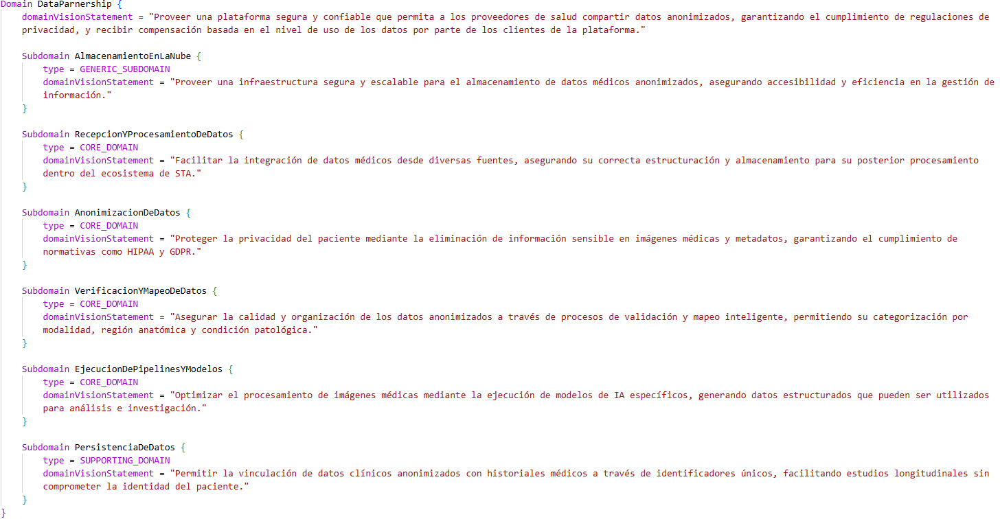
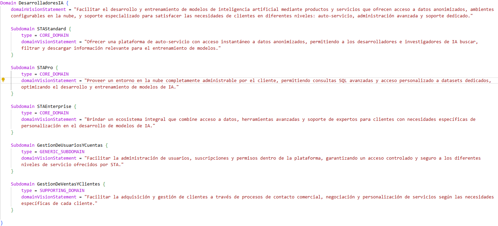
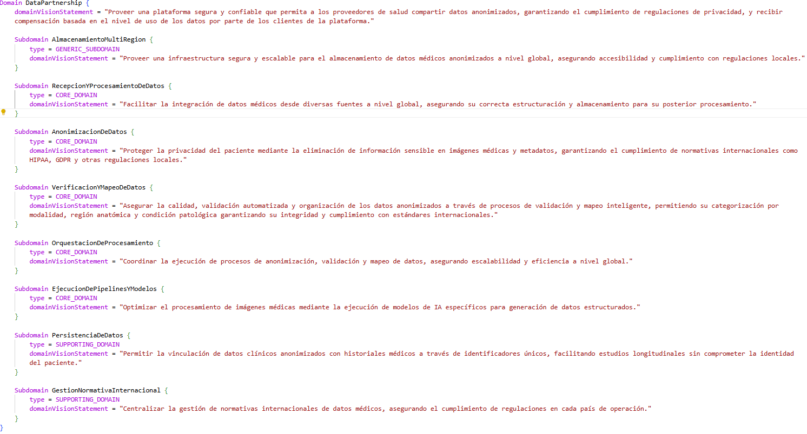
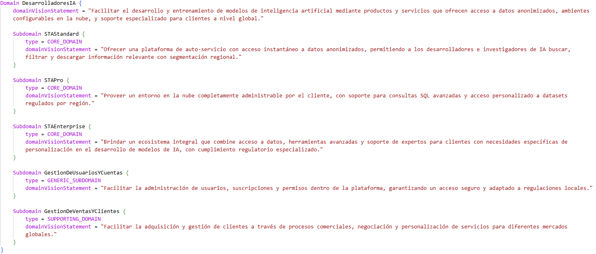
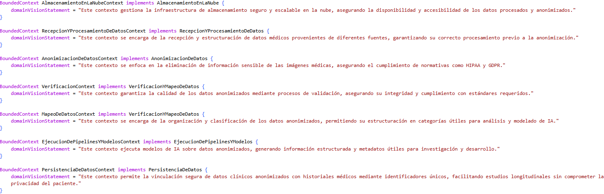
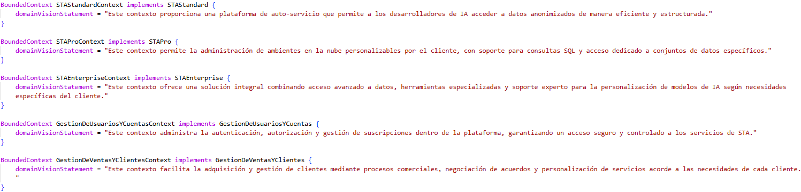
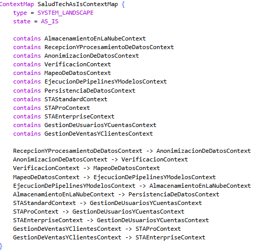
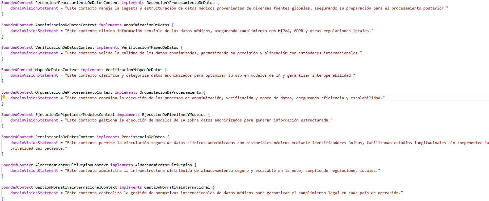
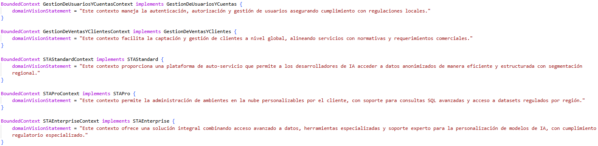

# Estructura del Proyecto SaludTech

Este proyecto utiliza como base una plantilla preexistente para el correcto uso del repositorio en la plataforma Gitpod. Se han realizado ajustes en la configuración para asegurar su compatibilidad y se han creado los respectivos archivos .cml para la generación de modelos.

## Estructura del arbol del Proyecto

1. **.github**: Contiene configuraciones y flujos de trabajo para GitHub Actions (automatización de tareas como CI/CD).

2. **gradle/wrapper**: Configuración y archivos para la herramienta Gradle, que se utiliza para la compilación y gestión de dependencias del proyecto.

3. **src/main/cml**: Carpeta que contiene los archivos CML del proyecto. En este caso, incluye:
   - `salud_tech_as_is.cml`: Modelo de dominio actual.
   - `salud_tech_to_be.cml`: Modelo de dominio futuro.

4. **.gitignore**: Define los archivos y carpetas que deben ser ignorados por Git en el control de versiones.

5. **.gitpod.Dockerfile y .gitpod.yml**: Configuraciones para ejecutar el proyecto en Gitpod, un entorno de desarrollo basado en la nube.

6. **LICENSE**: Archivo que contiene la licencia del proyecto.

7. **README.md**: Archivo principal para la documentación del proyecto.

8. **build.gradle**: Archivo de configuración de Gradle para compilar y ejecutar el proyecto.

9. **gradle.properties**: Propiedades globales para Gradle, como configuraciones específicas de la herramienta.

10. **gradlew y gradlew.bat**: Scripts para ejecutar Gradle en entornos UNIX y Windows respectivamente, sin necesidad de instalarlo localmente.

11. **settings.gradle**: Configuración general del proyecto Gradle, donde se definen las propiedades principales.

12. **image-*.png**: Imagenes usadas para el README.md

## Documentación de Dominios y Sub-Dominios

En este apartado se encuentran los enlaces a los archivos donde se definen los dominios y subdominios del proyecto. Además, se indican las líneas exactas en las que estos están especificados utilizando la sintaxis de ContextMapper.

- [Enlace a archivo .cml con dominios y sub-dominios AS_IS](https://github.com/JGarcia55/DDDLovers/blob/master/src/main/cml/salud_tech_as_is.cml)

    - Entre las líneas 1 y 33 se encuentran definidos el dominio y los subdominios de DataPartnership

    

    - Entre las líneas 35 y 68 se encuentran definidos el dominio y los subdominios de DesarrolladoresIA

    

- [Enlace a archivo .cml con dominios y sub-dominios TO_BE](https://github.com/JGarcia55/DDDLovers/blob/master/src/main/cml/salud_tech_to_be.cml)

    - Entre las líneas 1 y 43 se encuentran definidos el dominio y los subdominios de DataPartnership

    

    - Entre las líneas 45 y 72 se encuentran definidos el dominio y los subdominios de DesarrolladoresIA

    

## Documentación del Lenguaje Ubicuo

En este apartado se encuentra la documentación del **Event Storming** para el Lenguaje Ubicuo del flujo de **Anonimización AS-IS y TO-BE**. Para facilitar su consulta, proporcionamos varios enlaces: el primero dirige a la herramienta utilizada para desarrollar la documentación, el segundo a un archivo PDF con la información, y finalmente, en la carpeta **src/main/resources/lenguaje_ubicuo**, también se puede encontrar el PDF correspondiente.

- [Enlace al Miro](https://miro.com/app/board/uXjVLlSzI4g=/?share_link_id=436043877662)
- [Enlace a OneDrive: Lenguaje Ubicuo.pdf](https://uniandes-my.sharepoint.com/:b:/g/personal/ja_parrar12_uniandes_edu_co/EZZ_k-th_gtEncVaUikwT70BeSq2PFAkjXVL-BEkIvAVQw?e=cVjzVY)

## Documentación de Contextos Acotados y MapContext

- [Enlace a archivo .cml con los contextos acotados y el MapContext para el AS_IS](https://github.com/JGarcia55/DDDLovers/blob/master/src/main/cml/salud_tech_as_is.cml)

    - Entre las líneas 65 y 91 se encuentran definidos los contextos acotados de DataPartnership

    

    - Entre las líneas 93 y 110 se encuentran definidos los contextos acotados de DesarrolladoresIA

    

    - Entre las líneas 113 y 141 se encuentra definido el MapContext para el AS_IS

    - En la carpeta **src/main/resources** podrás encontrar el archivo **salud_tech_as_is_ContextMap.png** el cual es la imagen generada por el MapContext para el AS_IS

    
    
- [Enlace a archivo .cml con los contextos acotados y el MapContext para el TO_BE](https://github.com/JGarcia55/DDDLovers/blob/master/src/main/cml/salud_tech_to_be.cml)

    - Entre las líneas 74 y 108 se encuentran definidos los contextos acotados de DataPartnership

    

    - Entre las líneas 110 y 128 se encuentran definidos los contextos acotados de DesarrolladoresIA

    

    - Entre las líneas 130 y 162 se encuentra definido el MapContext para el TO_BE

    

    - En la carpeta **src/main/resources** podrás encontrar el archivo **salud_tech_to_be_ContextMap.png** el cual es la imagen generada por el MapContext para el TO_BE

## Colaboradores

| Colaborador                 | Correo                                |
|-----------------------------|---------------------------------------|
| Jeniffer Corredor           | j.corredore@uniandes.edu.co           |
| Juan Diego García           | j.garcia55@uniandes.edu.co            |
| Brayan Ricardo García       | br.garciam1@uniandes.edu.co           |
| Jhon Andrés Parra Rodríguez | ja.parrar12@uniandes.edu.co           |